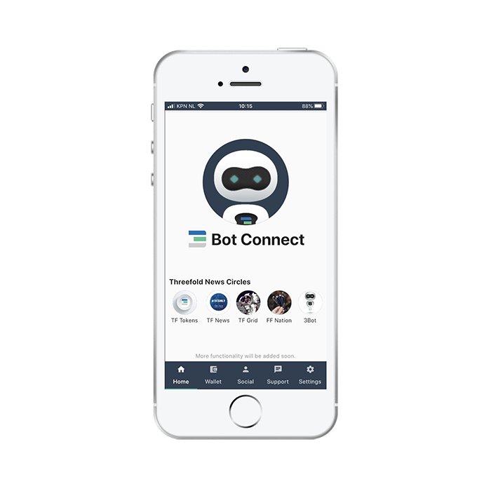
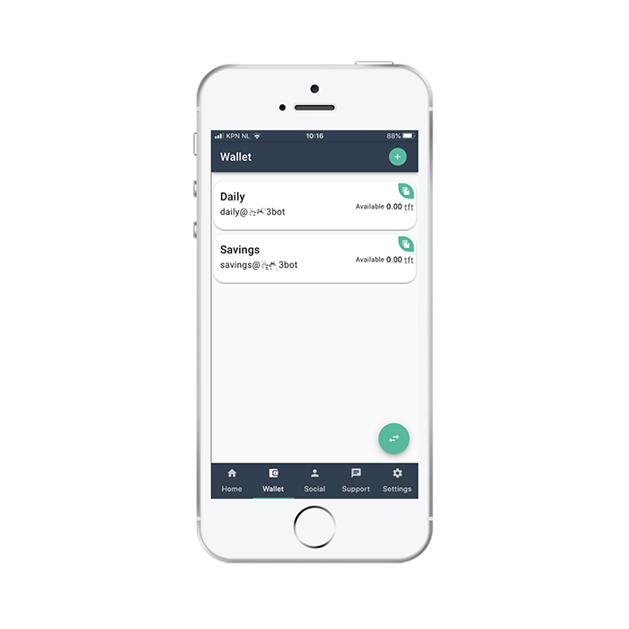
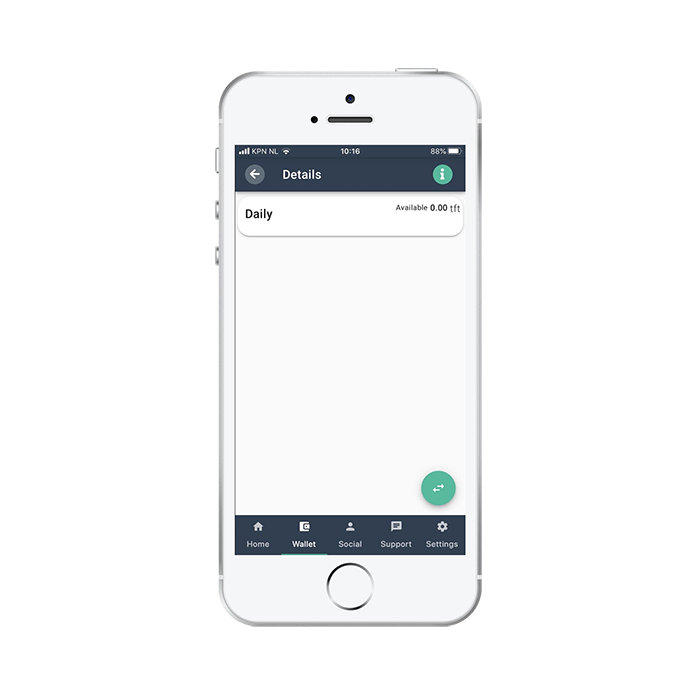

# Tokens To Setup Your 3Bot

As purchasers of a 3Node at BetterToken we will send you an initial (small) amount of TFT to help you set up your 3Bot.
You can reach out via: [tokensfor3bot@bettertoken.com](mailto:tokensfor3bot@bettertoken.com)

Please include in this email:

- Your Name
- Farmname
- ThreeFold Wallet Address

## How To Get Your Wallet Address

## Wallet

In this tab you can check your ThreeFold Tokens wallets and balances. You can copy your wallet address using the green "Copy" buttons for each specific wallet. Using the button in the bottom right side you can send or generate QR code to receive ThreeFold Tokens:

##### How to get your wallet Address

###### Step 1

Click Wallet in the main nav bar at the bottom of the screen.

###### Step 2

Click the wallet you would like to see the address from (if you want to copy paste the address you can always use the green button with the white copy icon in the top right part of you wallet block)

###### Step 3

Click the green button with the Info (i) icon in the top right part of your screen

###### Step 4

You can now see your wallet address.
