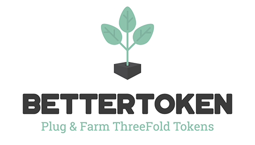

# BetterToken

BetterToken is the first ever ThreeFold Farming Cooperative in Europe with a very simple goal: Make it easy for people to engage and become a part of the ThreeFold Movement. 

What does this mean:
- Make it possible for anyone to become a farmer in the most simple ways. 
- Help our customers to get started with their services and applications on the ThreeFold Grid.

# The ThreeFold Story In A NutShell
<iframe width="560" height="315" src="https://www.youtube.com/embed/AAV4yYZ_P3k" frameborder="0" allow="accelerometer; autoplay; encrypted-media; gyroscope; picture-in-picture" allowfullscreen></iframe>

# Why We Do What We Do

At BetterToken we believe that the mission of the ThreeFold Foundation needs to become reality.
ThreeFold Foundation has created and is expanding a new internet based on 3 pillars that the current internet is lacking

- Equality: Internet is declared a human right, yet over 40% of the world's population currently remains disconnected. The ThreeFold Grid is setup in a way nodes (servers) can be brought to life anywhere on the world where there's a network and power supply.
- Autonomy: Anybody should be able to move freely in the internet without having their data exploited for financial gains, power, and manipulation. ThreeFold puts the user as the sole owner of it's data, the TF Grid itself is owned by everyone that participates which decentralizes the ownership and thus counters monopoly's and exploiting.
- Sustainability: The internet should be of service to the world and not have a negative impact on the environment. ThreeFold's decentralized approach and 'less is more' approach to software makes that the Grid can function at a fraction of what current solutions need.

## Farming Equipment & Services

BetterToken provides people that are looking to become a ThreeFold Farmer with several ways to do so.
- [SoHo Node](soho_nodes.md)
- [Node Hosting](node_hosting.md)
- [Cloud Farming (future)](cloudfarming.md)

## Services & Applications On The Grid

BetterToken has a service for their existing and new customers to buy a service pack to help them bring their solution to the ThreeFold Grid.
Find out more [here](solutions_applications.md)

